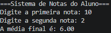

# Media do aluno

Sistema que calcula a media do aluno e mostrando se ele foi aprovado ou reprovado

**A linguagem utilizada: Python**

**Como executar**
1. Pergunta a primeira nota e a segunda nota
2. Calcula a média
3. Mostra a nota para o aluno e se ele foi aprovado ou reprovado

    

**Contato**

📧 E-mail: [lucaslimaolft@gmail.com](mailto:lucaslimaolft@gmail.com)

💼 LinkedIn: [lucaslimaol](https://linkedin.com/in/lucaslimaol)